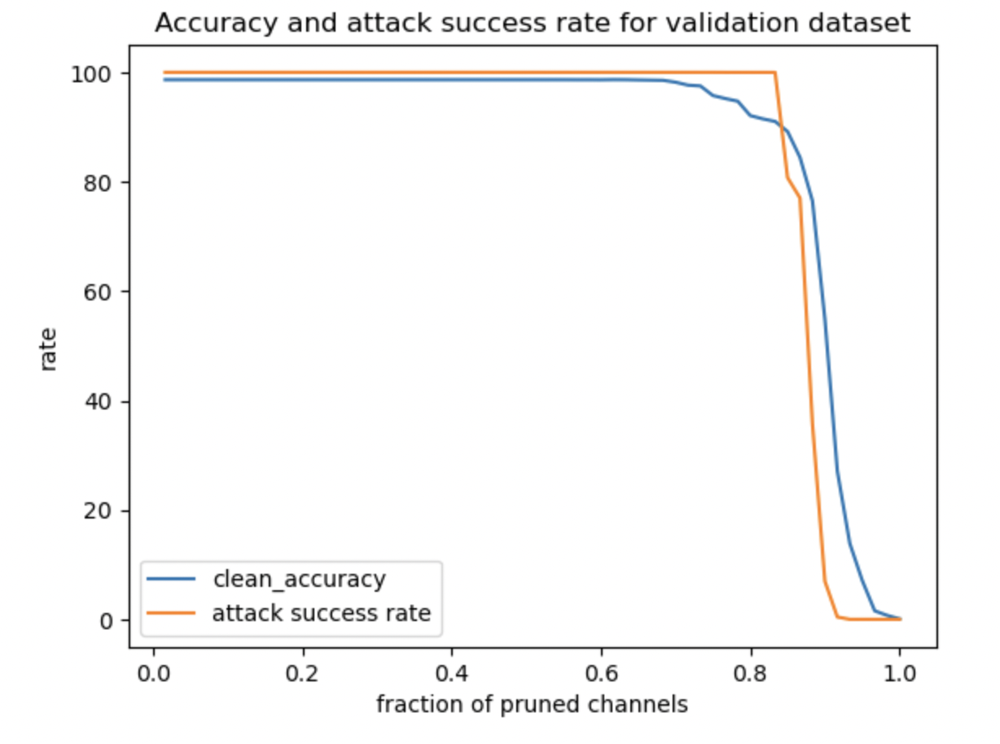
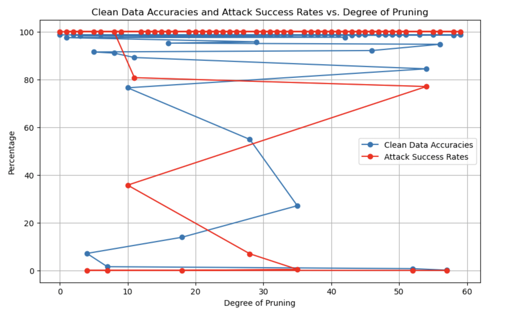
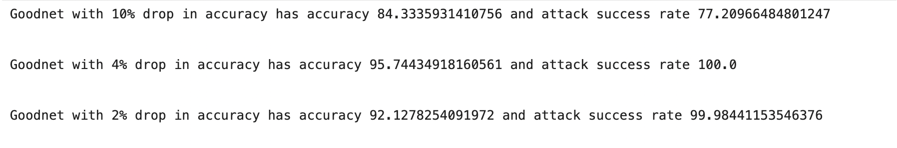

# Backdoor Attacks Report
Name: Avani Vaishnav  
NetID: av3141

## Table of Contents
- [Introduction](#Introduction)
- [Methodology](#Methodology)
- [Observations](#Observations)
- [Prerequisites](#prerequisites)
- [Installation](#installation)

### Introduction
BadNets or backdoored netweorks are malicious networks that have a state-of-teh art perfomrance on the clean training and validaton set but behave badly on the attack's chosen trainign and validation samples. In this assignemnt we use pruning defense on a maliciously trained model to prune nodes that are only activated when malicious data is input into the netwok. 

### Methodology
The general idea is to prune the neural network and compare its performance with the original network to detect any discrepancies caused by the presence of a backdoor. We recall that backdoors activated unues/spare neurons in the network.

The pruning defense works as follows: the defender exercises the DNN received from the attacker with clean inputs from the validation dataset, Dvalid, and records the average activation of each neuron. The defender then iteratively prunes neurons from the DNN in increasing order of average activations and records the accuracy of the pruned network in each iteration. The defense terminates when the accuracy on the validation dataset drops below a pre-determined threshold.

We prune neurons from the ```'pool_3'``` layer, before the```FC``` layers. We use the **weights pruning** method where pruning is perfrmed by setting the weights and bias of that channel to 0. 

### Observations
As per the instructions we need to save the model when the accuracy drops below X% ={2,4,10}. The models saved for these accuracy drops are ```model_X=2.h5```,```model_X=4.h5``` and ```model_X=10.h5``` respectively. 

The accuracies of the model on clean data and the attack success rates of the model on malicious data are recorded. The  accuracy on clean test data and the attack success rate (on backdoored test data) as a function of the fraction of channels pruned (X) is clearly visualized in this graph. 



Clean data accuracies and attack success rates versus degree of pruning can be visualized in this graph. 



We then combine the pruned model and the BadNet B to create a GoodNet G. The results of the combination on the same data are as follows:



We observe that with an accuracy drop on 10% from the original accuracy of the network, the attack success rate is still quite high (77.21%). 

### Prerequisites
Install the below packages if you are running this code on a Mac Silicon chip.
```bash
# create a conda environment
conda create -y --name cv
# activate the environment
conda activate cv

# install specified verisons of libraries
conda install -y -c apple tensorflow-deps==2.10.0
python -m pip install tensorflow-macos==2.10.0
python -m pip install tensorflow-metal==0.6.0
```
### Installation
Download dataset and model from this [link](https://github.com/csaw-hackml/CSAW-HackML-2020/tree/master/lab3) 

```bash
# Clone the repository
git clone https://github.com/avani1998/ECE-9163-ML-for-cybersecurity.git

# Change into the project directory
cd ECE-9163-ML-for-cybersecurity

# Install dependencies
pip install -r requirements.txt
